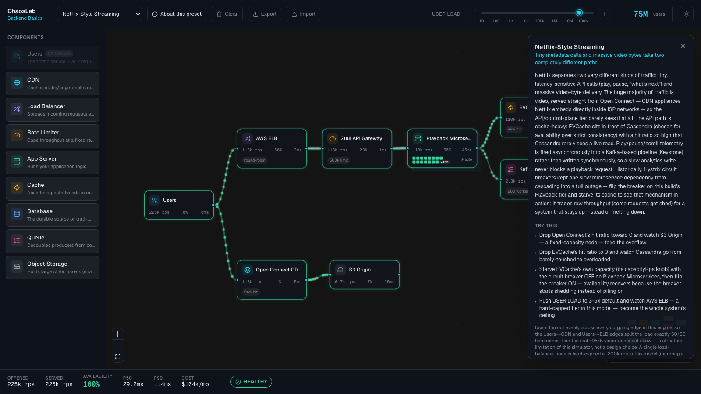
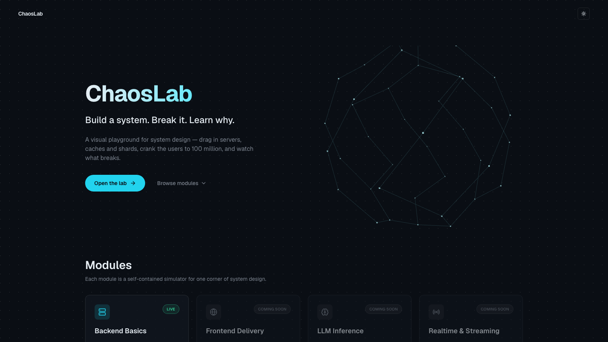
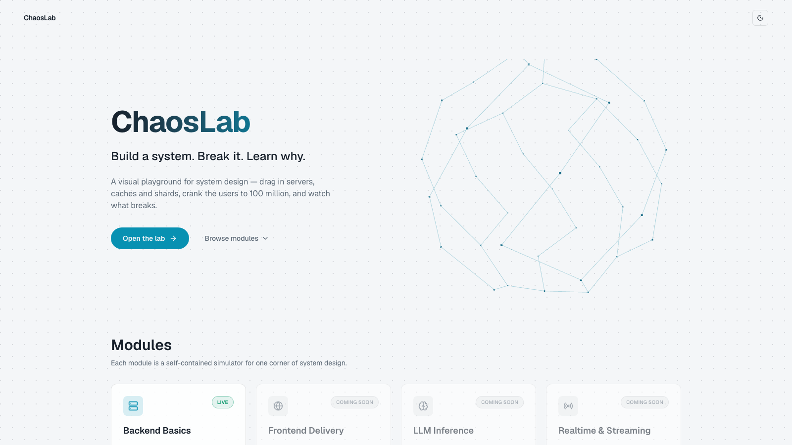
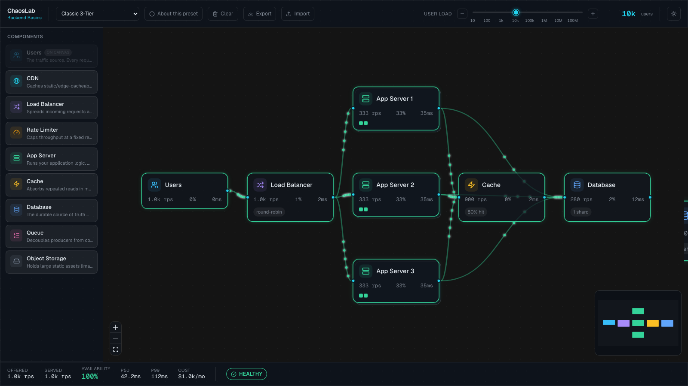
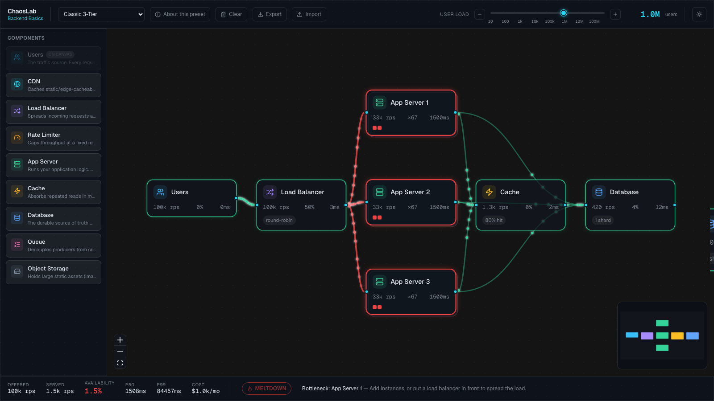
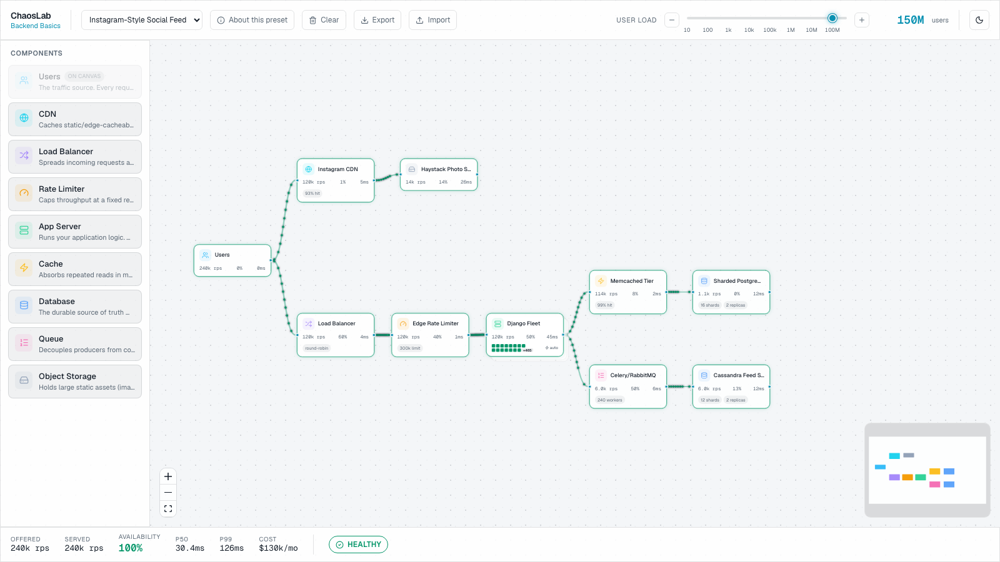
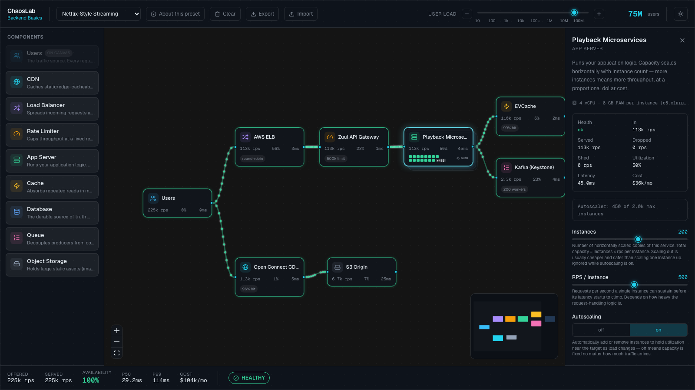

# ChaosLab

**Build a system. Break it. Learn why.**

ChaosLab is an interactive system-design playground. Drag components onto a whiteboard, wire them into an architecture, crank the user load from 10 to 500 million with a single slider, and watch queueing-theory math decide — in real time — what holds up and what melts down.



## Screenshots

| | |
|---|---|
|  **Landing — dark mode** |  **Landing — light mode** |
|  **Classic 3-Tier — healthy at 10k users** |  **Same graph in meltdown at 1M users** |
|  **Instagram-Style Social Feed — light mode** |  **Inspector — pods, autoscaler, config sliders** |

## Features

- **9 components** — Users, CDN, Load Balancer, Rate Limiter, App Server, Cache, Database, Queue, Object Storage — each with an educational one-line description and a generically-rendered config panel.
- **Resilience knobs** — horizontal autoscaling with a live pod-grid visualization, retries, a circuit breaker, connection pools (Little's-Law-bound), and pub/sub fan-out mode for queues.
- **An analytical simulation engine** — an M/M/1-flavored queueing model, strict flow conservation across arbitrary graphs (cycles, fan-in/fan-out, disconnected nodes), and cascading failure propagation. Pure, deterministic, no randomness.
- **Animated particle data flow** — SVG particles ride every edge, scaling in count and color with real traffic and drop rate, capped globally so the canvas stays smooth under load.
- **6 presets**, including real-world-inspired **Netflix-Style Streaming** and **Instagram-Style Social Feed** builds researched from public engineering blogs and papers — sources are cited in-app alongside each preset's explanation.
- **Per-preset explanations & experiments** — a dismissible panel explaining what the architecture teaches, plus concrete "try this" experiments to run against the live simulation.
- **Dark / light themes**, JSON export/import, and debounced `localStorage` autosave so a graph survives a refresh.

## How the simulation works

Traffic starts at a `users` node (`users × rpsPerUser`, split into reads/writes by a read/write ratio) and propagates through the graph in topological order (Kahn's algorithm; cycles are broken by ignoring back-edges, with a graph warning surfaced). Each node applies its own behavior — a cache absorbs a share of reads, a rate limiter sheds excess, a load balancer splits traffic across downstream targets, a server passes through what its instance count can serve — and the engine computes per-node capacity, utilization, and an M/M/1-flavored queueing latency (`latency = base × (1 + ρ² / (1 − ρ))`) from it. Utilization drives a five-stage health state per node (`ok → warn → hot → overloaded → down`), and those states roll up into end-to-end p50/p99 latency, availability, cost, and an overall verdict — **HEALTHY**, **DEGRADED**, or **MELTDOWN**.

## Presets

| Preset | Story | Default load |
|---|---|---|
| Hello World | Users → Server → Database — the simplest possible backend | 100 users |
| Classic 3-Tier | LB → 3 servers → cache → DB — the bread-and-butter production layout | 10,000 users |
| Read-Heavy at Scale | CDN + cache absorb reads before a sharded DB ever sees them | 1,000,000 users |
| Netflix-Style Streaming | Tiny API calls via Zuul/EVCache/Cassandra alongside video bytes that bypass the app tier via Open Connect CDN → S3 | 75,000,000 users |
| Instagram-Style Social Feed | CDN-served media bypasses the app tier to Haystack storage; the main path (LB → rate limiter → Django → Memcached → sharded Postgres) fans writes out asynchronously via Celery/RabbitMQ | 150,000,000 users |
| Planet Scale | Every lever at once — CDN, rate limiter, twin LBs, 200 servers, cache, write-behind queue, 64-shard DB — barely healthy at 100M, meltdown at 500M | 100,000,000 users |

## Tech stack

- [Next.js 16](https://nextjs.org) (App Router, TypeScript)
- [React Flow 12](https://reactflow.dev) (`@xyflow/react`) for the canvas
- [zustand](https://github.com/pmndrs/zustand) for state
- [Three.js](https://threejs.org) / [React Three Fiber](https://docs.pmnd.rs/react-three-fiber) for the landing page hero
- Tailwind CSS v4
- [vitest](https://vitest.dev) — 37 tests covering the simulation engine

## Getting started

```bash
npm install
npm run dev    # http://localhost:3000
npm test       # run the vitest suite
```

## Roadmap

Three more modules are planned, visible on the landing page as "coming soon":

- **Frontend Delivery** — CDNs, edge caching, and asset delivery
- **LLM Inference** — batching, KV caches, and GPU queues
- **Realtime & Streaming** — WebSockets, pub/sub, and backpressure
